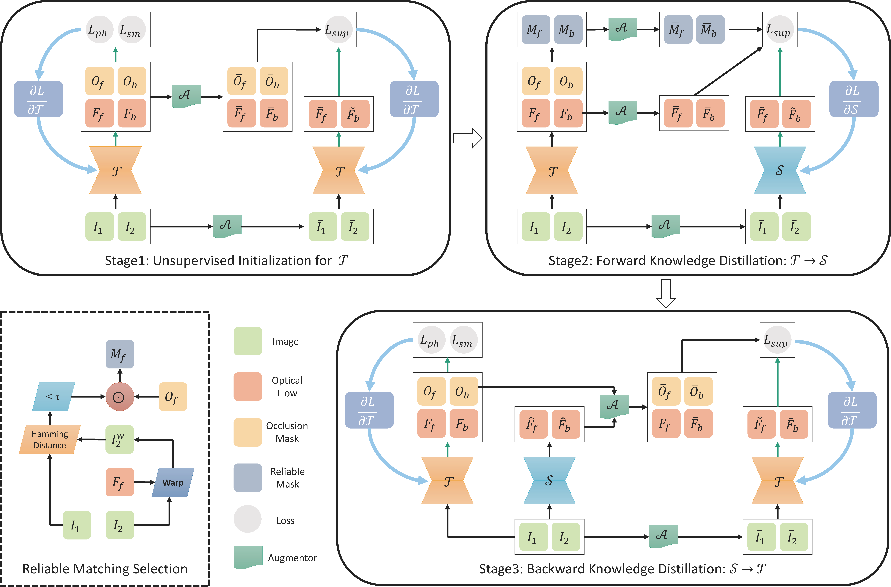
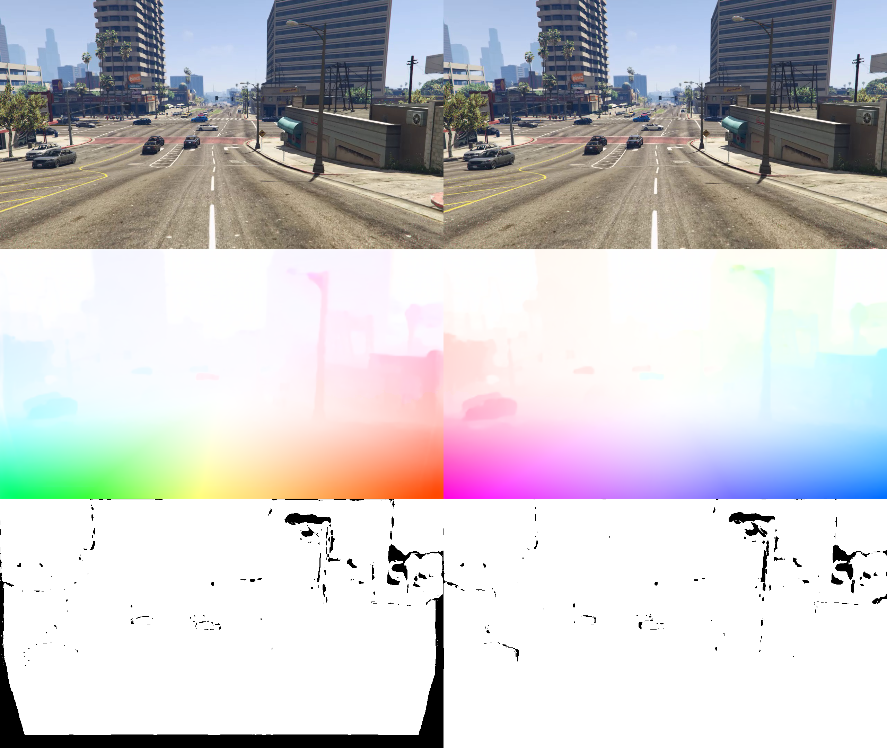
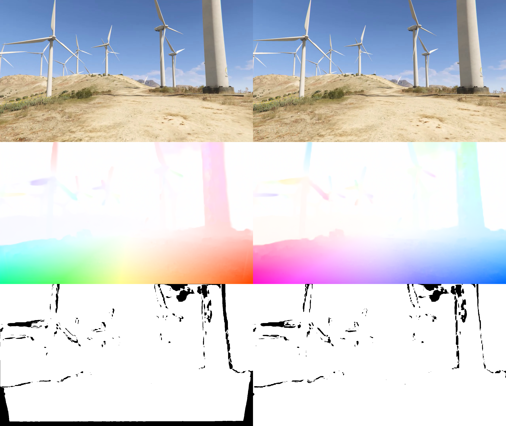

# MDFlow: Unsupervised Optical Flow Learning by Reliable Mutual Knowledge Distillation
The official PyTorch implementation of [MDFlow](https://arxiv.org/abs/2211.06018) (TCSVT 2022) (Only for Evaluation and Downstream Applications).

This repository provides MDFlow algorithm pre-trained [FastFlowNet](https://github.com/ltkong218/FastFlowNet) on Flying Chairs, GTA V, MPI Sintel and KITTI 2015 sequences.

Authors: [Lingtong Kong](https://scholar.google.com.hk/citations?user=KKzKc_8AAAAJ&hl=zh-CN), [Jie Yang](http://www.pami.sjtu.edu.cn/jieyang)

## Abstract
Recent works have shown that optical flow can be learned by deep networks from unlabelled image pairs based on brightness constancy assumption and smoothness prior. Current approaches additionally impose an augmentation regularization term for continual self-supervision, which has been proved to be effective on difficult matching regions. However, this method also amplify the inevitable mismatch in unsupervised setting, blocking the learning process towards optimal solution. To break the dilemma, we propose a novel mutual distillation framework to transfer reliable knowledge back and forth between the teacher and student networks for alternate improvement. Concretely, taking estimation of off-the-shelf unsupervised approach as pseudo labels, our insight locates at defining a confidence selection mechanism to extract relative good matches, and then add diverse data augmentation for distilling adequate and reliable knowledge from teacher to student. Thanks to the decouple nature of our method, we can choose a stronger student architecture for sufficient learning. Finally, better student prediction is adopted to transfer knowledge back to the efficient teacher without additional costs in real deployment. Rather than formulating it as a supervised task, we find that introducing an extra unsupervised term for multi-target learning achieves best final results. Extensive experiments show that our approach, termed MDFlow, achieves state-of-the-art real-time accuracy and generalization ability on challenging benchmarks.

## Framework
Detailed framework of reliable mutual knowledge distillation for unsupervised optical flow.

To our best knowledge, it is the first time that mutual knowledge distillation framework is introduced to unsupervised optical flow, which can efficiently leverage countless unlabeled video sequences for optical flow learning. Moreover, proposed MDFlow framework is general and does not depend on particular optical flow architectures (it can use any efficient teacher flow network and any powerful student flow network) and unsupervised initialization method.

## Environment
Python == 3.6.x

PyTorch == 1.2.0

Download our pre-trained [FastFlowNet](https://github.com/ltkong218/FastFlowNet) teacher network and [RAFT](https://github.com/princeton-vl/RAFT) student network in this [link](https://www.dropbox.com/sh/m99c01b9140v0r2/AAAVTX27wEMlMGTXnRIeL9QMa?dl=0), and then put file <code> checkpoints</code> into the root dir.

Make sure that [<code>Pytorch-Correlation-extension</code>](https://github.com/ClementPinard/Pytorch-Correlation-extension) is installed successfully. You can refer to [FastFlowNet](https://github.com/ltkong218/FastFlowNet) for more installation details.

## Performance

Unsupervised optical flow accuracy on Sintel Clean and KITTI 2015 datasets. Note that MDFlow-Fast uses the efficient [FastFlowNet](https://github.com/ltkong218/FastFlowNet) for evaluation, which can achieve on par unsupervised optical flow accuracy with other heavier methods.

|             | Sintel Clean Train (AEPE) | Sintel Clean Test (AEPE) | KITTI 2015 Train (AEPE) | KITTI 2015 Test (Fl-all) |
|:-----------:|:------------------------:|:------------------------:|:------------------------:|:------------------------:|
|    ARFlow   |           2.79           |           4.78           |           2.85           |          11.80%          |
|    SimFlow  |           2.86           |           5.92           |           5.19           |          13.38%          |
|    UFlow    |           2.50           |           5.21           |           2.71           |          11.13%          |
| MDFlow-Fast |           2.53           |           4.73           |           3.02           |          11.43%          |

## Visualization

Predicted bidirectional optical flow and occlusion map of efficient FastFlowNet on GTA V.

## Citation
When using any parts of the Software or the Paper in your work, please cite the following paper:
<pre><code>@Article{Kong_2022_TCSVT,
  author={Kong, Lingtong and Yang, Jie}, 
  journal={IEEE Transactions on Circuits and Systems for Video Technology}, 
  title={MDFlow: Unsupervised Optical Flow Learning by Reliable Mutual Knowledge Distillation}, 
  year={2022}, 
  doi={10.1109/TCSVT.2022.3205375}
}</code></pre>
